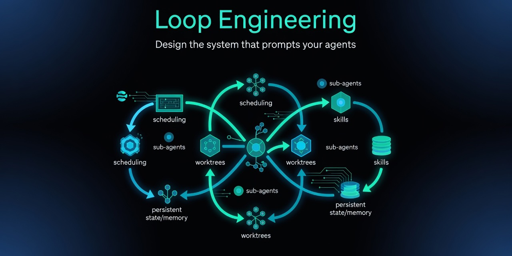
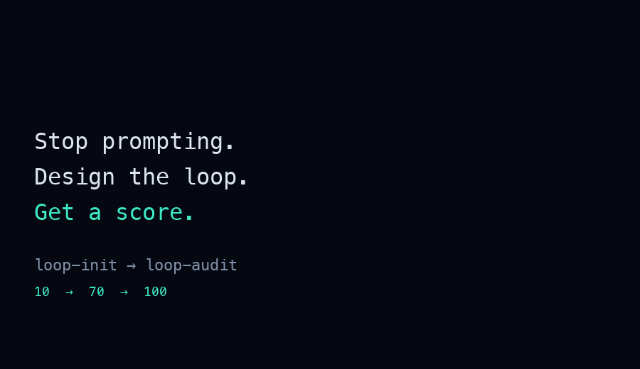
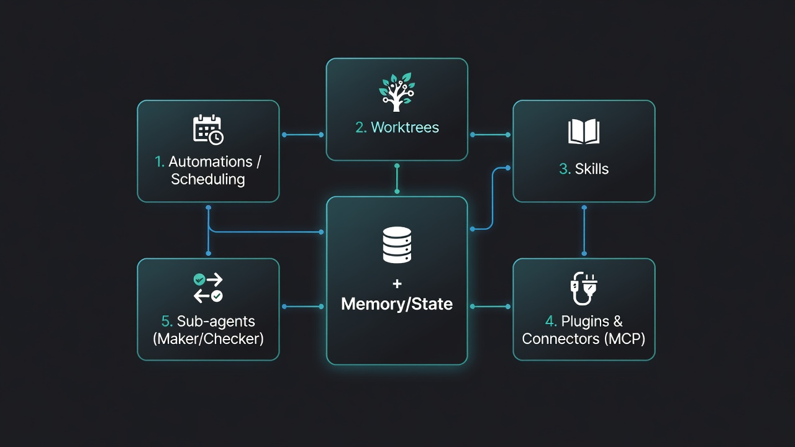
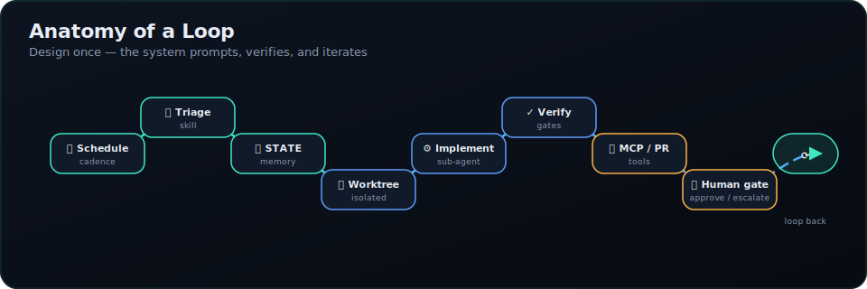
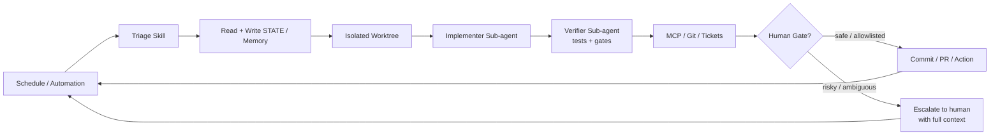
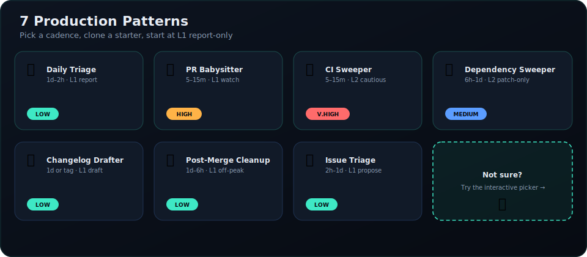

# Agent Loops


<!-- GitHub Pages: Enable in Settings → Pages (deploy from main, /docs folder) -->

<p align="center">
  <a href="https://github.com/KevinZhangNothing/agent-loops/stargazers"></a>
  <a href="https://github.com/KevinZhangNothing/agent-loops/actions/workflows/audit.yml"></a>
<!-- npm packages: @kevinzhangnothing/loop-* — publish pending (see docs/REBRAND-NPM.md) -->
  <a href="https://github.com/KevinZhangNothing/agent-loops/blob/main/LICENSE"></a>
</p>


<!-- Showcase logo link pending GitHub Pages deployment -->
<p align="center">
  
</p>

> **Stop prompting. Design the loop. Get a score.**

<p align="center">
  
</p>

```bash
npx @kevinzhangnothing/loop-init .
```

`loop-init` scaffolds skills, state, and budget files, then prints your **Loop Ready** score and first loop command. Swap `--tool` for `claude`, `codex`, or `opencode`.

<p align="center">
  <a href="docs/QUICKSTART.md">
    
  </a>
</p>

Agent loops replace you as the person who prompts the agent — you design the system that does it instead.

**New here?** [Quickstart (5 min)](docs/QUICKSTART.md)

For developers using Grok, Claude Code, Codex, Cursor, and other AI coding agents.

<p align="center">
  <strong>→ Practical reference for agent loop patterns</strong>
</p>

## Contents

- [Quickstart (5 min)](docs/QUICKSTART.md)
- [Quick Links](#quick-links)
- [Why This Matters](#why-this-matters)
- [The Five Building Blocks + Memory](#the-five-building-blocks--memory)
- [Patterns](#patterns)
- [Getting Started (5 minutes)](#getting-started-5-minutes)
- [Examples by Tool](#examples-by-tool)
- [pi Coding Agent Integration](#pi-coding-agent-integration)
- [Operating & Safety](#operating--safety)
- [Caveats](#caveats)
- [Contributing](#contributing)
- [Sources](#sources)
- [License](#license)

## Quick Links

| Start here | Description |
|------------|-------------|
| [Quickstart (5 min)](docs/QUICKSTART.md) | Scaffold → cost check → audit → first loop — **start here if you just landed** |
| [New Contributor Guide](docs/NEW-CONTRIBUTOR-GUIDE.md) | First contribution in under 30 minutes |
| [Docs Index](docs/README.md) | Complete documentation navigation |
| [Agent Loops essay](https://github.com/KevinZhangNothing/agent-loops/blob/main/PI-INTEGRATION-COMPLETE.md) | The concept, primitives, and the agent-loops reference |
| [**pi Integration**](docs/PI-INTEGRATION.md) | **NEW:** Plug agent-loops into the [pi coding agent](https://pi.mcp.dev) — 12 skills, 3 workflows, one `install.sh` |
| [Pattern Picker](docs/pattern-picker.md) | Which loop to run first — **start here if unsure** |
| [Primitives Matrix](docs/primitives-matrix.md) | Cross-tool loop primitive mapping — bookmark this |
| [Loop Design Checklist](docs/loop-design-checklist.md) | Ship readiness rubric |
| [Project Health](PROJECT-HEALTH.md) | Real-time status dashboard |
| [Patterns](patterns/README.md) | 7 production patterns + [pattern picker](docs/pattern-picker.md) |
| [Starters](starters/) | Clone-and-run kits (Grok, Claude Code, Codex, Opencode) |
| [Opencode examples](examples/opencode/) | CLI-first loops: cron/systemd + `opencode run`, skills, worktrees |
| [loop-audit](tools/loop-audit/) | Loop Readiness Score CLI (v1.5 + constraints scoring) — `npx @kevinzhangnothing/loop-audit . --suggest` · `--badge` for README |
| [loop-init](tools/loop-init/) | Scaffold starters + budget/run-log + constraints (v1.2) — `npx @kevinzhangnothing/loop-init . --pattern daily-triage --tool grok` |
| [loop-cost](tools/loop-cost/) | Token spend estimator — `npx @kevinzhangnothing/loop-cost` |
| [loop-sync](tools/loop-sync/) | Drift detection between `STATE.md` and `LOOP.md` — `npx @kevinzhangnothing/loop-sync .` |
| [loop-context](tools/loop-context/) | Stateful memory manager + circuit breaker for long runs — `npx @kevinzhangnothing/loop-context --check --ledger run.json` |
| [loop-mcp-server](tools/mcp-server/) | MCP runtime lookup for patterns, skills, state — `npx @kevinzhangnothing/loop-mcp-server` |
| [loop-worktree](tools/loop-worktree/) | Manage isolated git worktrees per fix attempt — `npx @kevinzhangnothing/loop-worktree create --run-id <id> --pattern <p>` |
| [pi skill: loop-guard](pi/skills/loop-guard/) | Circuit breaker for fix-capable loops — wraps `loop-context --check` + `loop-ledger.json` |
| [pi skill: loop-sync](pi/skills/loop-sync/) | STATE.md ↔ LOOP.md drift detection — wraps `@kevinzhangnothing/loop-sync` |
| [pi skill: rebase-and-clean](pi/skills/rebase-and-clean/) | Safe PR rebase + cleanup for pr-babysitter workflow |
| [pi install](pi/install.sh) | One-shot installer: `bash pi/install.sh` copies 12 skills + 3 workflows + mcp.json to `~/.pi/agent/` |
| [Rebrand to @kevinzhangnothing](docs/REBRAND-NPM.md) | **3 manual steps + 2 scripts** to publish 8 packages under the new npm scope |
| [Goal Engineering](docs/concepts.md#goal-vs-loop) | **Companion concept:** loops discover, goals finish — see [Goal vs Loop](docs/concepts.md#goal-vs-loop) |
| [Stories](stories/) | Real wins and honest failures |
| [Contributor quickstart](https://github.com/KevinZhangNothing/agent-loops/discussions/123) | **Help wanted:** 25 scoped `good first issues` — comment *I'll take this* to get assigned |
| [Community update](https://github.com/KevinZhangNothing/agent-loops/discussions/145) | **July 4:** 5.5k stars, traffic sources, contributor merges |
| [Prior release notes](https://github.com/KevinZhangNothing/agent-loops/discussions/89) | v1.5.0 — loop-sync, constraints, MCP server |
| [Add your project](https://github.com/KevinZhangNothing/agent-loops/discussions/92) | **Pinned:** Loop Ready badge + adopters list |

<p align="center">
  
</p>

## Why This Matters

Peter Steinberger:
> "You shouldn't be prompting coding agents anymore. You should be designing loops that prompt your agents."

Boris Cherny (Head of Claude Code at Anthropic):
> "I don't prompt Claude anymore. I have loops running that prompt Claude and figuring out what to do. My job is to write loops."

The leverage point has moved from crafting individual prompts to designing the control systems that orchestrate agents over time.

## The Five Building Blocks + Memory

| Primitive | Job in the Loop |
|-----------|-----------------|
| **Automations / Scheduling** | Discovery + triage on a cadence |
| **Worktrees** | Safe parallel execution |
| **Skills** | Persistent project knowledge |
| **Plugins & Connectors** | Reach into your real tools (MCP) |
| **Sub-agents** | Maker / checker split |
| **+ Memory / State** | Durable spine outside any conversation |

Full detail: [docs/primitives.md](docs/primitives.md) · Cross-tool matrix: [docs/primitives-matrix.md](docs/primitives-matrix.md)

### Visual Overview

<p align="center">
  
</p>

### Anatomy of a Loop

<p align="center">
  
</p>

<details>
<summary>Mermaid diagram (copy-friendly)</summary>



</details>

**This reference repo now runs its own `validate-patterns` + `audit` workflows on every push/PR** (see `.github/workflows/`). We also added `LOOP.md` describing the loops that will maintain it.

## Patterns

<p align="center">
  
</p>

| Pattern | Cadence | Starter | Week 1 | Token cost |
|---------|---------|---------|--------|------------|
| [Daily Triage](patterns/daily-triage.md) | 1d–2h | [minimal-loop](starters/minimal-loop/) | **L1** report | Low |
| [PR Babysitter](patterns/pr-babysitter.md) | 5–15m | [pr-babysitter](starters/pr-babysitter/) | L1 watch | High |
| [CI Sweeper](patterns/ci-sweeper.md) | 5–15m | [ci-sweeper](starters/ci-sweeper/) | L2 cautious | Very high |
| [Dependency Sweeper](patterns/dependency-sweeper.md) | 6h–1d | [dependency-sweeper](starters/dependency-sweeper/) | L2 patch-only | Medium |
| [Changelog Drafter](patterns/changelog-drafter.md) | 1d or tag | [changelog-drafter](starters/changelog-drafter/) | **L1** draft | Low |
| [Post-Merge Cleanup](patterns/post-merge-cleanup.md) | 1d–6h | [post-merge-cleanup](starters/post-merge-cleanup/) | **L1** off-peak | Low |
| [Issue Triage](patterns/issue-triage.md) | 2h–1d | [issue-triage](starters/issue-triage/) | **L1** propose-only | Low |

Not sure which to pick? See [pattern-picker](docs/pattern-picker.md).

Machine-readable index: [patterns/registry.yaml](patterns/registry.yaml) (7 patterns)

## Getting Started (5 minutes)

```bash
# 1. Scaffold + get your Loop Ready score (printed automatically)
npx @kevinzhangnothing/loop-init . --pattern daily-triage --tool grok

# 2. Estimate token spend for your cadence
npx @kevinzhangnothing/loop-cost --pattern daily-triage --level L1

# 3. Re-audit after improvements
npx @kevinzhangnothing/loop-audit . --suggest

# Optional: paste Loop Ready badge into your README
npx @kevinzhangnothing/loop-audit . --badge

# 4. See scores climb: empty → L1 → L2
bash scripts/before-after-demo.sh

# 5. Start report-only (Grok example)
/loop 1d Run loop-triage. Update STATE.md. No auto-fix in week one.
```

All three CLIs publish to npm from tagged releases — see [docs/RELEASE.md](docs/RELEASE.md). No clone required.

**Develop from source** (monorepo contributors):

```bash
cd tools/loop-init && npm ci && npm test && node dist/cli.js /path/to/project --pattern daily-triage --tool grok
cd tools/loop-audit && npm ci && npm test && node dist/cli.js /path/to/project --suggest
cd tools/loop-cost && npm ci && npm test && node dist/cli.js --pattern ci-sweeper --cadence 15m
```

Phased rollout: **L1 report → L2 assisted fixes → L3 unattended** — see [loop-design-checklist](docs/loop-design-checklist.md).

## Examples by Tool

- [Grok](examples/grok/daily-triage.md)
- [Claude Code](examples/claude-code/)
- [Codex](examples/codex/)
- [OpenClaw](examples/openclaw/daily-triage.md)
- [Opencode](examples/opencode/)
- [GitHub Actions](examples/github-actions/)

## pi Coding Agent Integration

[pi](https://pi.mcp.dev) is a coding-agent framework that supports Skills, MCP servers, Workflows, and Shortcuts. Agent-loops ships a complete integration kit under [`pi/`](pi/):

| Component | Count | Purpose |
|-----------|-------|---------|
| Skills (`pi/skills/`) | 12 | `loop-audit`, `loop-init`, `loop-triage`, `loop-cost`, `loop-budget`, `loop-verifier`, `minimal-fix`, `loop-sync`, `loop-guard`, `ci-triage`, `pr-review-triage`, `rebase-and-clean` |
| Workflows (`pi/workflows/`) | 3 | `daily-triage` (L1, 09:00 Asia/Shanghai), `pr-babysitter` (L2, every 15min), `ci-sweeper` (L2, every 10min + circuit breaker) |
| MCP servers (`pi/mcp.json`) | 1 (+ 9 CLI shortcuts) | `AgentLoops` (real MCP server); `LoopAudit`/`LoopInit`/`LoopCost` 作为 `+loop-*` shortcuts |
| Shortcuts | 6 | `+loop-score`, `+loop-init`, `+loop-cost`, `+loop-state`, `+loop-log`, … |
| Installer | 1 | `bash pi/install.sh` — expands `~`, backs up existing skills |

### Install in 30 seconds

```bash
cd path/to/your-project
bash path/to/agent-loops/pi/install.sh     # → ~/.pi/agent/

# In pi, try:
#   +loop-score          → audit + readiness score
#   +loop-score-suggest  → audit + copy-paste fixes
#   +loop-init           → scaffold loop into your project
```

The installer honors `~/.pi/agent/` as the default, expands `~/custom-target` paths, and **backs up** any pre-existing skill/workflow before overwrite (`.backup.YYYYMMDDHHMMSS`).

### What this adds to a pi session

- **Skills** the agent can invoke: `loop-audit`, `loop-init`, `loop-triage`, `loop-cost`, `loop-guard`, `loop-sync`, `loop-verifier`, `minimal-fix`, `rebase-and-clean`, `ci-triage`, `pr-review-triage`, `loop-budget`.
- **MCP resources** the agent can read: `loop://registry`, `loop://patterns/*`, `loop://skills/*`, `loop://state/*`, `loop://budget`, `loop://run-log`, `loop://safety`.
- **Workflows** the agent can run: scheduled `daily-triage` (report-only), `pr-babysitter` (assistant, human gates merge), `ci-sweeper` (assistant with circuit breaker).

The new `loop-guard` skill wraps every fix iteration with `loop-context --check --ledger loop-ledger.json` and escalates instead of looping in vain. `loop-sync` wraps `@kevinzhangnothing/loop-sync` for drift detection between `STATE.md` and `LOOP.md`. `rebase-and-clean` honors `loop-constraints.md` (denylist paths, protected branches, 3-attempt cap, draft PR first).

Full guide: [docs/PI-INTEGRATION.md](docs/PI-INTEGRATION.md) · 现状报告：[PI-INTEGRATION-COMPLETE.md](PI-INTEGRATION-COMPLETE.md)

## Operating & Safety

- [Failure Modes](docs/failure-modes.md) — incident-style catalog
- [Anti-Patterns](docs/anti-patterns.md) — design mistakes before production
- [Multi-Loop Coordination](docs/multi-loop.md) — when loops collide
- [Operating Loops](docs/operating-loops.md) — cost, logging, when to kill
- [Safety](docs/safety.md) — denylist, auto-merge, MCP scopes
- [Security](SECURITY.md) — reporting and unattended automation risks
- [Concepts](docs/concepts.md) — intent debt, comprehension debt, harness vs loop
- [MCP Cookbook](examples/mcp/) — connector examples by pattern

## Caveats

Agent loops amplify judgment — both good and bad.

- **Token costs** can explode with sub-agents and long-running loops.
- **Verification is still on you.** Unattended loops make unattended mistakes.
- **Comprehension debt** grows faster unless you read what the loop ships.
- Two people can run the same loop and get opposite results. The loop doesn't know. You do.

> "Build the loop. But build it like someone who intends to stay the engineer, not just the person who presses go."
> — *Attributed in community discussions*

## Help wanted

**First PR?** Start with the [contributor quickstart](https://github.com/KevinZhangNothing/agent-loops/discussions/123) — ~10 min to ~1 hr tasks with same-day review on stories and adopters. See [CONTRIBUTORS.md](CONTRIBUTORS.md) for everyone who has shipped so far.

| Pick one | Issue |
|----------|-------|
| ~10 min | [#120 — Add your project to adopters](https://github.com/KevinZhangNothing/agent-loops/issues/120) |
| ~15 min | [#227 — `loop-sync` subsection in QUICKSTART](https://github.com/KevinZhangNothing/agent-loops/issues/227) |
| ~30 min | [#147 — Cline appendix](https://github.com/KevinZhangNothing/agent-loops/issues/147) · [#220 — Cursor CI Sweeper example](https://github.com/KevinZhangNothing/agent-loops/issues/220) |
| ~45 min | [#225 — Hermes PR Babysitter example](https://github.com/KevinZhangNothing/agent-loops/issues/225) |
| ~1 hr | [#230](https://github.com/KevinZhangNothing/agent-loops/issues/230) / [#231](https://github.com/KevinZhangNothing/agent-loops/issues/231) — **your story** (worktree week-two, multi-loop failure) |

Comment **"I'll take this"** on any [`good first issue`](https://github.com/KevinZhangNothing/agent-loops/issues?q=is%3Aissue+is%3Aopen+label%3A%22good+first+issue%22) for assignment.

## Contributing

Share production patterns, tool mappings, and failure stories. See [CONTRIBUTING.md](CONTRIBUTING.md) (contribution ladder + [`good first issue` backlog](https://github.com/KevinZhangNothing/agent-loops/issues?q=is%3Aissue+is%3Aopen+label%3A%22good+first+issue%22)), [adopters](docs/adopters.md), and [GitHub Discussions](https://github.com/KevinZhangNothing/agent-loops/discussions).

## Sources

- [Attribution & further reading](resources/sources.md)

## License

MIT

---

*Practical, tool-aware reference for agent loops, patterns you can clone, checklists you can ship against, and stories that include what broke.*

<p align="center">
  <a href="https://github.com/KevinZhangNothing">Kevin Zhang</a>
</p>
