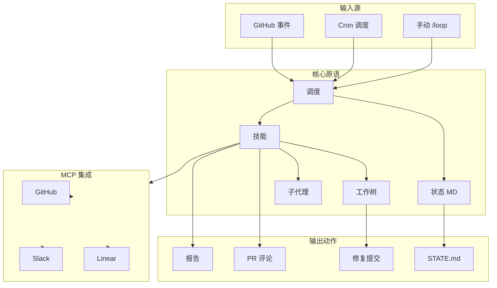
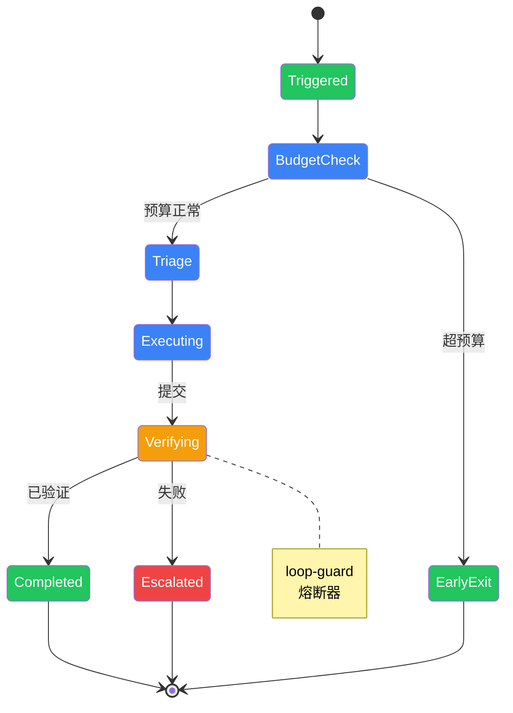

# Agent Loops

> **停止提示。设计循环。获得评分。**

面向使用 Grok、Claude Code、Codex、Cursor 等 AI 编程代理的开发者。

---

<p align="center">
  <strong>🌐 选择语言：</strong>
  <a href="README.md">English</a> ·
  <a href="README.zh-CN.md">简体中文</a>
</p>

---

```bash
npx @kevinzhangnothing/loop-init .
```

Agent Loops 取代你作为提示代理的人 —— 你设计的是执行提示的系统。

<p align="center">
  <a href="https://github.com/KevinZhangNothing/agent-loops/stargazers"></a>
  <a href="https://github.com/KevinZhangNothing/agent-loops/actions/workflows/audit.yml"></a>
  <a href="https://www.npmjs.com/package/@kevinzhangnothing/loop-audit"></a>
  <a href="https://www.npmjs.com/package/@kevinzhangnothing/loop-init"></a>
  <a href="https://github.com/KevinZhangNothing/agent-loops/blob/main/LICENSE"></a>
</p>

## 快速开始

**5 分钟完成第一个 Loop：**

```bash
# 1. 脚手架（打印 Loop 就绪评分）
npx @kevinzhangnothing/loop-init . --pattern daily-triage --tool grok

# 2. 检查 token 成本
npx @kevinzhangnothing/loop-cost --pattern daily-triage --level L1

# 3. 审计 + 获取下一步建议
npx @kevinzhangnothing/loop-audit . --suggest

# 4. 运行第一个 Loop（仅报告，第 1 周）
/loop 1d 运行 loop-triage。更新 STATE.md。不自动修复。
```

👉 **[完整快速入门指南 →](docs/QUICKSTART.md)**

## 什么是 Agent Loops？

> "你不应该再手动提示编程代理了。你应该设计能够提示代理的循环系统。"

### 架构概览



<p align="center">
  <em>打开 <a href="docs/diagrams/agent-loops-architecture.html">交互式架构图</a> 或访问 <a href="docs/zh-CN/DIAGRAMS.md">图表文档</a> 查看详情。</em>
</p>

| 原语 | 用途 |
|------|------|
| **调度** | 按节奏运行分类（cron、`/loop`、自动化） |
| **状态** | 对话外的持久化记忆（`STATE.md`） |
| **技能** | 可复用的能力（`SKILL.md`） |
| **工作树** | 安全的并行执行（隔离的 git worktrees） |
| **子代理** | 制作者/检查者分离用于验证 |
| **MCP** | 连接真实工具（GitHub、Linear、Slack） |

**[核心概念 →](docs/zh-CN/CONCEPTS.md)** | **[原语 →](docs/zh-CN/PRIMITIVES.md)**

## 模式

| 模式 | 节奏 | 第 1 周 | Token 成本 |
|------|------|--------|-----------|
| [每日分类](patterns/daily-triage.md) | 1 天–2 小时 | 仅报告 | 低 |
| [PR 保姆](patterns/pr-babysitter.md) | 5–15 分钟 | 仅监控 | 高 |
| [CI 清洁工](patterns/ci-sweeper.md) | 5–15 分钟 | 谨慎修复 | 非常高 |
| [依赖清洁工](patterns/dependency-sweeper.md) | 6 小时–1 天 | 仅补丁 | 中 |
| [变更日志起草](patterns/changelog-drafter.md) | 1 天或标签 | 仅起草 | 低 |
| [Issue 分类](patterns/issue-triage.md) | 2 小时–1 天 | 仅提议 | 低 |

### 执行流程



<p align="center">
  <em>打开 <a href="docs/diagrams/loop-execution-lifecycle.html">交互式生命周期图</a> 查看状态转换和验证门禁详情。</em>
</p>

👉 **[所有模式 →](patterns/README.md)** | **[模式选择器 →](docs/PATTERN_PICKER.md)**

## 工具

**从 npm 安装：**
```bash
npx @kevinzhangnothing/loop-init . --pattern daily-triage --tool grok
npx @kevinzhangnothing/loop-audit . --suggest
npx @kevinzhangnothing/loop-cost --pattern daily-triage --level L1
```

**从源码运行（monorepo）：**
```bash
npm run build:tools  # 构建所有工具
node tools/loop-init/dist/cli.js . --pattern daily-triage
node tools/loop-audit/dist/cli.js . --suggest
node tools/loop-cost/dist/cli.js --pattern daily-triage --level L1
```

| 工具 | npm 包 | 描述 |
|------|--------|------|
| `loop-init` | `@kevinzhangnothing/loop-init` | 脚手架 loop + 打印就绪评分 |
| `loop-audit` | `@kevinzhangnothing/loop-audit` | 评分就绪度 + 获取下一步建议 |
| `loop-cost` | `@kevinzhangnothing/loop-cost` | 按节奏估算 token 花费 |
| `loop-sync` | `@kevinzhangnothing/loop-sync` | 检测 STATE.md ↔ LOOP.md 漂移 |
| `loop-context` | `@kevinzhangnothing/loop-context` | 状态化记忆 + 熔断器 |
| `loop-worktree` | `@kevinzhangnothing/loop-worktree` | 每次修复的隔离 git worktrees |
| `loop-mcp-server` | `@kevinzhangnothing/loop-mcp-server` | MCP 运行时查找 |

**[工具文档 →](tools/README.md)**

## 按工具分类的示例

- **[Grok](examples/grok/daily-triage.md)** — `/loop` 调度
- **[Claude Code](examples/claude-code/)** — `/loop` + 技能
- **[Codex](examples/codex/)** — 自动化标签
- **[Opencode](examples/opencode/)** — cron/systemd + `opencode run`
- **[Cursor](examples/cursor/)** — 自动化 + 规则
- **[GitHub Actions](examples/github-actions/)** — CI 原生 loops

## 项目状态

本项目使用自己的模式：

| 文件 | 用途 |
|------|------|
| [`STATE.md`](STATE.md) | 当前 loop 状态（实时） |
| [`LOOP.md`](LOOP.md) | 活动 loops 和节奏 |
| [`loop-budget.md`](loop-budget.md) | Token 上限和终止开关 |
| [`loop-run-log.md`](loop-run-log.md) | 运行历史 |

## 贡献

分享生产模式、工具示例和失败故事。

**第一次 PR？** 从 [`good first issues`](https://github.com/KevinZhangNothing/agent-loops/issues?q=is%3Aissue+is%3Aopen+label%3A%22good+first+issue%22) 开始

👉 **[贡献指南 →](CONTRIBUTING.md)** | **[添加你的项目 →](docs/adopters.md)**

## 文档

### 核心

| 文档 | 描述 |
|------|------|
| **[快速入门](docs/QUICKSTART.md)** | 5 分钟从零到第一个 loop |
| **[概念](docs/concepts.md)** | 意图债务、理解债务、harness vs loop |
| **[原语](docs/PRIMITIVES.md)** | 5 个构建块 + 记忆 |
| **[安全](docs/safety.md)** | 拒绝列表、自动合并策略、MCP 范围 |
| **[工具矩阵](docs/TOOL_MATRIX.md)** | 跨工具能力映射 |

### 集成

| 文档 | 描述 |
|------|------|
| **[pi 集成](docs/PI-INTEGRATION.md)** | pi 编程代理集成（12 个技能，3 个工作流） |
| **[发布](docs/PUBLISH.md)** | npm 包发布指南 |

### 社区

| 文档 | 描述 |
|------|------|
| **[采用者](docs/adopters.md)** | 使用 agent loops 的项目 |
| **[贡献](CONTRIBUTING.md)** | 贡献指南 |

## 许可证

MIT — 见 [LICENSE](LICENSE)

---

*设计提示 AI 编程代理系统的实用参考。*
