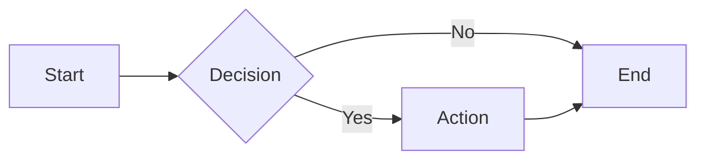
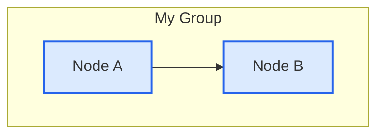

# Agent Loops Diagrams

Mermaid diagrams for Agent Loops documentation.

  <strong>🌐 Select Language:</strong>
  <a href="./DIAGRAMS.md">English</a> ·
  <a href="zh-CN/DIAGRAMS.md">简体中文</a>

---

## 📐 About These Diagrams

All diagrams in this repository use **Mermaid** syntax, which renders natively on GitHub. You can view them directly in:

- **GitHub.com** — Diagrams render automatically in markdown files
- **VS Code** — Install the "Markdown Preview Mermaid Support" extension
- **Mermaid Live Editor** — [mermaid.live](https://mermaid.live) for editing and exporting

### Diagram Locations

| Diagram | Location |
|---------|----------|
| **Architecture** | [README.md](../README.md#architecture-overview) |
| **Execution Lifecycle** | [README.md](../README.md#execution-flow) |
| **Pattern Comparison** | [README.md](../README.md#pattern-comparison) |

---

## 🛠️ Working with Mermaid

### Syntax Reference

### Exporting Diagrams

1. **From GitHub:** Take a screenshot of the rendered diagram
2. **Mermaid Live Editor:** Paste code → Download PNG/SVG
3. **VS Code:** Right-click diagram → Save as image

### Styling Tips

---

## 📖 Related Documentation

- [Core Concepts](CONCEPTS.md) — Intent debt, comprehension debt, harness vs loop
- [Primitives](PRIMITIVES.md) — The 5 building blocks + memory
- [Safety](safety.md) — Denylists, auto-merge policy, MCP scopes
- [Quickstart](QUICKSTART.md) — 5-minute path from zero to first loop
