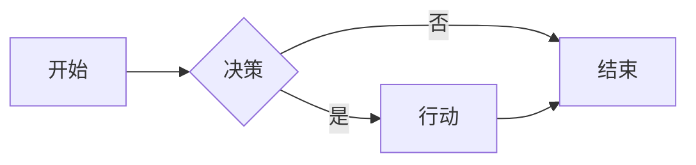
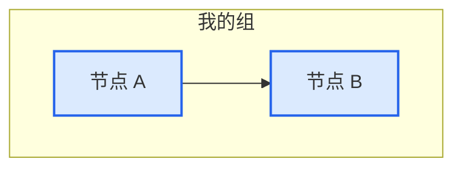

# Agent Loops 图表文档

Agent Loops 的 Mermaid 图表文档。

  <strong>🌐 选择语言：</strong>
  <a href="../DIAGRAMS.md">English</a> ·
  <a href="./DIAGRAMS.md">简体中文</a>

---

## 📐 关于图表

本仓库的所有图表都使用 **Mermaid** 语法，可在 GitHub 上直接渲染。查看方式：

- **GitHub.com** — 图表在 markdown 文件中自动渲染
- **VS Code** — 安装 "Markdown Preview Mermaid Support" 扩展
- **Mermaid Live Editor** — [mermaid.live](https://mermaid.live) 用于编辑和导出

### 图表位置

| 图表 | 位置 |
|------|------|
| **架构图** | [README.md](../README.zh-CN.md#架构概览) |
| **执行生命周期** | [README.md](../README.zh-CN.md#执行流程) |
| **模式对比** | [README.md](../README.zh-CN.md#模式对比) |

---

## 🛠️ 使用 Mermaid

### 语法参考

### 导出图表

1. **从 GitHub:** 截图渲染后的图表
2. **Mermaid Live Editor:** 粘贴代码 → 下载 PNG/SVG
3. **VS Code:** 右键图表 → 保存为图片

### 样式技巧

---

## 📖 相关文档

- [核心概念](concepts.md) — 意图债务、理解债务、harness vs loop
- [原语](PRIMITIVES.md) — 5 个构建块 + 记忆
- [安全](safety.md) — 拒绝列表、自动合并策略、MCP 范围
- [快速入门](../QUICKSTART.md) — 5 分钟从零到第一个 loop
